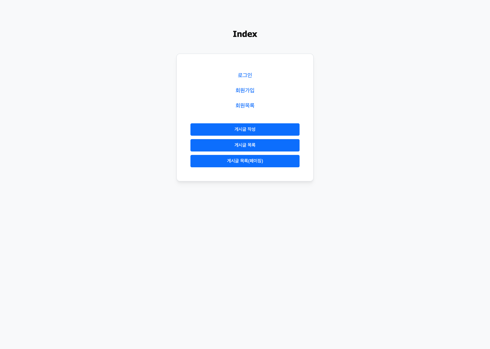
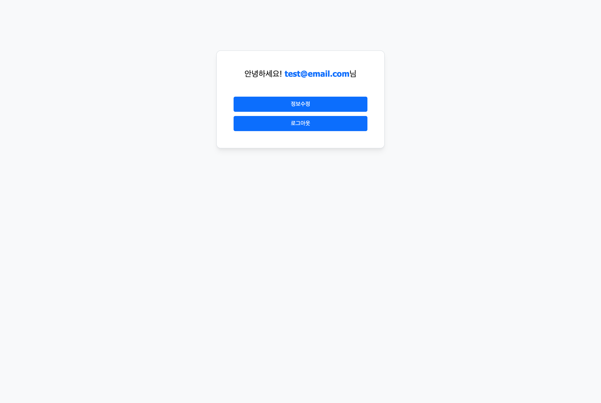
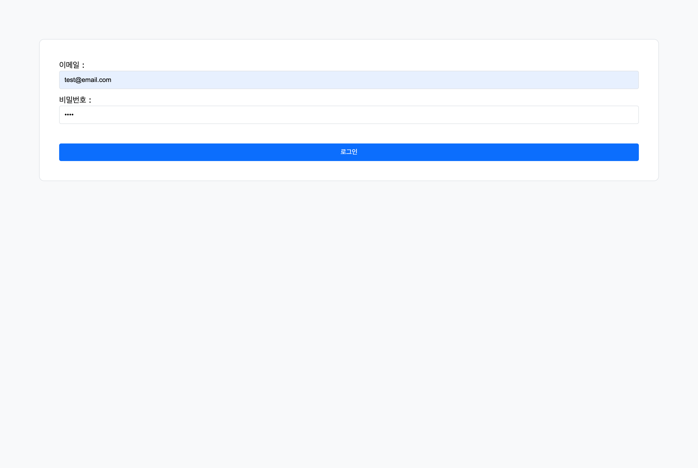
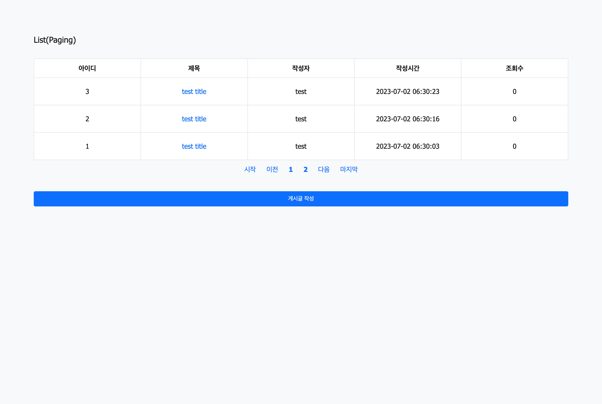

# spring-boot-board-sample
> Spring Boot Board Sample.

<br>

## Development Environment
<div style="display: inline-block">
    
    
    
    
    
    
    
    
    
</div>

<br>

- IDE : IntelliJ IDEA
- Language : HTML5, CSS3, JavaScript (ES6), JAVA 11 (JDK 11.0.18)
- Library : jQuery 3.6.3
- Framework : Spring Boot 2.7.8
- Build Tool : Gradle 7.6
- DBMS : MySQL 8.0.31 for Linux

<br>

## Main Function
- 회원(member)
  - 로그인(login) : /member/login
    - 로그아웃(logout) : /member/logout
    - 회원가입(join) : /member/join
    - 회원목록(list) : /member/
    - 회원정보 조회(detail) : /member/{id}
    - 회원정보 수정(update) : /member/update
    - 회원정보 삭제(delete) : /member/delete/{id}

- 게시판(board)
  - 게시글 작성(write) : /board/write
    - 게시글 목록(list) : /board/
    - 게시글 조회(detail) : /board/{id}
    - 게시글 수정(update) : /board/update/{id}
    - 게시글 삭제(delete) : /board/delete/{id}
    - 게시글 페이징(paging) : /board/paging
        - /board/paging?page=1
    - 파일 첨부(file upload) : /board/write, /board/detail
      - 단일 파일 첨부, 다중 파일 첨부

<br>

## Add Function
- 회원(member)
    - ajax 이메일 중복체크 : /member/email-check

- 게시판(board)
    - ajax 댓글 작성 : /comment/write

<br>

## Create MySQL Database
```SQL
create database springboot_board;
create hoong@localhost identified by '8888';
grant all privileges on springboot_board.* to hoong@localhost;
```

<br>

## MySQL Database Table
```SQL
/* 회원 */
drop table if exists member;

create table member (
    id              bigint primary key not null auto_increment,
    member_email    varchar(255) unique null,
    member_name     varchar(255) null,
    member_password varchar(255) null
);


/* 게시판 */
drop table if exists board;

create table board (
    id             bigint primary key not null auto_increment,
    created_time   datetime default now() null,
    updated_time   datetime               null,
    board_writer   varchar(20)            not null,
    board_password varchar(255)           null,
    board_title    varchar(255)           null,
    board_contents varchar(500)           null,
    board_hits     int default 0          null,
    file_attached  int default 0          null
);


/* 게시판 파일 */
drop table if exists board_file;

create table board_file (
    id                 bigint primary key not null auto_increment,
    created_time       datetime default now() null,
    updated_time       datetime               null,
    original_file_name varchar(255)           null,
    stored_file_name   varchar(255)           null,
    board_id           bigint                 null,
    constraint fk_board_file foreign key (board_id) references board (id) on delete cascade
);


/* 댓글 */
drop table if exists comment;

create table comment (
    id               bigint primary key not null auto_increment,
    created_time     datetime default now() null,
    updated_time     datetime               null,
    comment_writer   varchar(20)            not null,
    comment_contents varchar(255)           null,
    board_id         bigint                 null,
    constraint fk_comment foreign key (board_id) references board (id) on delete cascade
);
```

<br>

## View
###### Index


###### Main


###### Member Login


###### Member Join


###### Member List


###### Member Detail


###### Board Write


###### Board List


###### Board Detail


###### Board Paging

